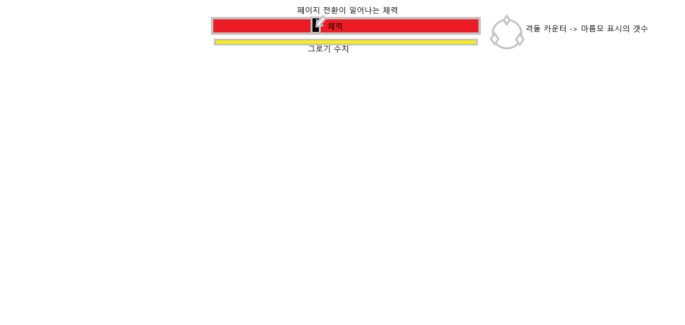

# SoulsLikeGame

## 범례: 해당 문서는 김대겸(필자)의 24년도 7월 부터 6개월 간의 소울라이크 게임 포트폴리오게임의 기획 및 개발 현황을 공개하는 문서 이다.

## 목차
+ ### [1.게임의 장르 및 컨셉, 플렛폼](#1-게임의-장르-및-컨셉-플렛폼)
+ ### [2.개발 엔진 및 언어](#2-개발-엔진-및-언어)
+ ### [3.핵심 시스템 기초 틀 정리](#3-핵심-시스템-기초-틀-정리)
+ ### [4.플레이어 캐릭터 조작키 및 스탯 상세](#4-플레이어-캐릭터-조작키-및-스탯-상세 )

### 1 게임의 장르 및 컨셉 플렛폼
#### 장르: 액션RPG, 소울라이크
#### 컨셉1. 높은 난이도의 보스와의 전투를 통한 성취감을 느끼는 게임
#### 컨셉2. 보스의 패턴에 맞춰서 대응하는 공략하는 게임
#### 컨셉3. 여러 타입의 플레이어 캐릭터를 만들어 다 회차를 진행 
#### 플랫폼: PC

### 2 개발 엔진 및 언어
#### 개발 언어: C++, Blueprint
#### 개발 엔진: Unreal Engine5.4
#### 사용 플러그인: Gameplay Ability System(GAS)

### 3 핵심 시스템 기초 틀 정리
#### 해당 부분은 기본적인 게임의 핵심 시스템을 문장으로서 정리한 것으로, 후에 각 파트의 상세 설명 부분에서 여러 도식을 이용하여 후술 함.
+ #### 전투 시스템
  + #### 엘든링, 세키로와 같은 소울라이크 게임의 전투 시스템을 구현.
  + #### 플레이어 캐릭터의 종류를 2~3개 준비하여 게임을 처음 시작하면 특정 캐릭터를 선택하여 진행하도록 구현
  + #### 플레이어는 보스 캐릭터의 패턴에 맞춰서 페링, 회피 및 점프 격돌을 이용하여, 적의 체력 or 그로기를 깍을 수 있음
  + #### 기본적으로 적의 HP(체력)이 0이되면 처치한 것으로 판단함.
  + #### 페링은 적의 공격이 맞기 직전에 튕겨내는 세키로 식의 페링을 채택함, 따라서 엘든링처럼 [페링 성공 -> 치명적 일격]으로 이어지는 것이 아닌, [페링 -> 그로기 수치 누적 -> 최대치 도달 ->그로기]형식으로 이루어지며, 그로기 시간동안 보스가 받는 피해가 증가하도록 구현.
  + #### 회피는 스탭 형식으로 특정 패턴을 파회해서 빈틈을 노리는 형식과 세키로의 하단 공격처럼 점프로 피하는 것으로(단 회피와 점프는 해당키가 다르게 설정함). 회피 및 점프는 성공 시 플레이어의 마나를 회복시킴.
  + #### 격돌은 보스에게 격돌 표시가 뜬 후 그이후의 공격을 적절히 페링 or 회피하는 것에 성공할 때마다 카운터를 깍고, 격돌 종료 시점에 보스의 카운터를 전부 깍았으면, 보스는 페링을 통한 그로기보다 더 긴 시간 그로기에 빠지고, 해당 시점에 공격하면, 일종의 처형 모션이 나와 매우 높은 데미지(보스의 체력을 %로 감소)와 함께 보스를 날려 보냄.
  + #### 가드 시스템은 적의 일반적인 공격을 막아낼 수 있으나 막을 때 마다 스태미나가 떨어지고, 다 떨어지면 그로기 상태에 걸림

+ #### 플레이어 캐릭터 시스템
  + #### 플레이어는 체력, 스태미나, 마나를 가지고 있음
  + #### 체력은 HP로 0이되면 사망함.
  + #### 스태미나는 행동에 필요함, 막기 중 0이되면 그로기에 걸림
  + #### 마나 플레이어의 스킬을 사용하는데 필요하며, 보스의 패턴을 점프 or 회피로 간파 하면 일정 수치를 회복 함.
  + #### 플레이어는 스탯을 지니며 각 보스를 잡을 때마다 10의 스탯 포인트를 가지고, 각 스탯을 분배 할 수 있음
  + #### 플레이어의 스탯은 체력(HP), 의지(스테미나), 근력(물리 공격력 증가), 재능(마나를 사용하는 스킬의 데미지 증가, 회복량 증가), 집중(치명타 확률 및 데미지 증가)를 가지고 있음.
  + #### 처음 시작하는 플레이어 캐릭터의 타입에따라, 시작 스탯은 다르지만, 총 30의 스탯이 분배되어 있음.

+ #### 보스 시스템
  + #### 보스는 체력, 그로기 수치, 격돌 카운터를 가지고 있음.
  + #### 체력이 0이 되면 해당 보스를 처치한 것으로 판단하여, 플레이어는 해당 보스를 잡은 증표를 획득 함.
  + #### 그로기 수치는 플레이어가 보스의 공격을 페링 할 때마다 깎이며, 전부 깎이면 그로기에 걸려 플레이어는 안정적으로 공격 할 수 있고, 이 때에서는 보스가 받는 데미지도 소폭 증가 한다.
  + #### 몇몇 보스는 체력이 일정 수치 미만이면, 시내마틱 컷신이 나오고 패턴 or 외형의 변경이 있는 페이지 전환이 있음.
  + #### 보스 UI 구상도.
  

### 4 플레이어 캐릭터 조작키 및 스탯 상세
+ ### 조작키
  
+ ### 스탯 상세
  
