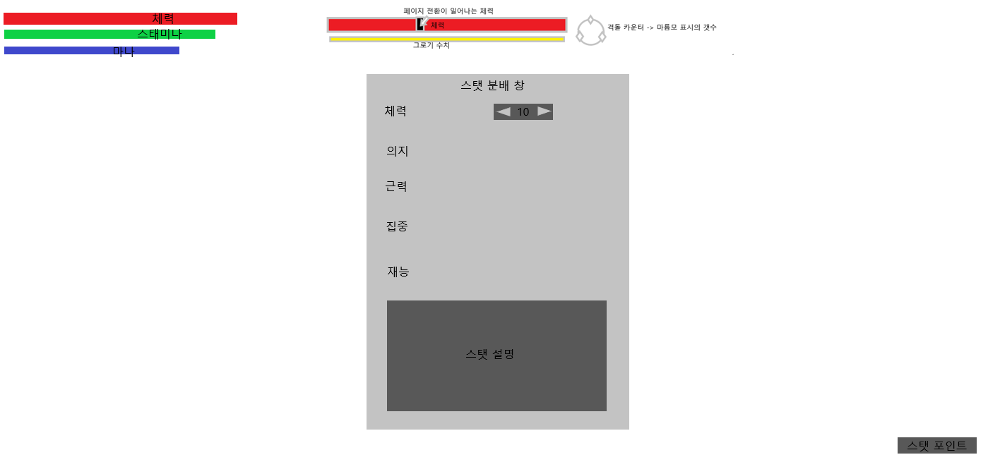
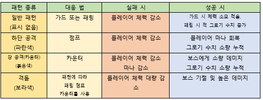
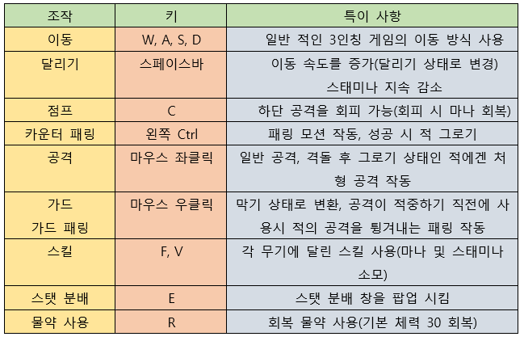
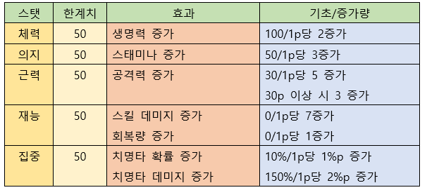
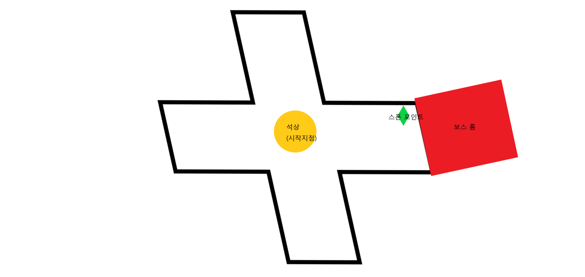
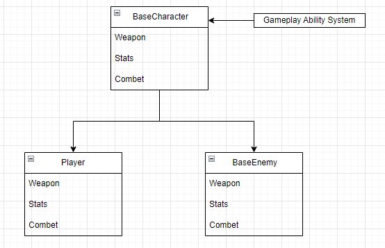
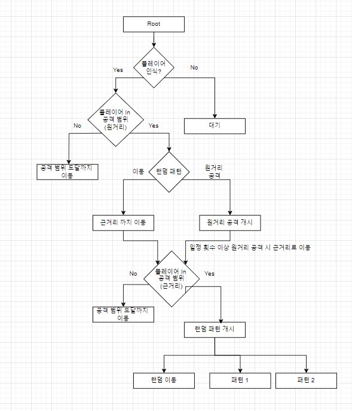

# SoulsLikeGame

## 범례: 해당 문서는 김대겸(필자)의 24년도 7월 부터 6개월 간의 소울라이크 게임 포트폴리오게임의 기획 및 개발 현황을 공개하는 문서 이다.

## 목차
+ ### [1.게임의 장르 및 컨셉, 플렛폼](#1-게임의-장르-및-컨셉-플렛폼)
+ ### [2.개발 엔진 및 언어](#2-개발-엔진-및-언어)
+ ### [3.핵심 시스템 기초 틀 정리](#3-핵심-시스템-기초-틀-정리)
+ ### [4.플레이어 캐릭터 조작키 및 스탯 상세](#4-플레이어-캐릭터-조작키-및-스탯-상세 )
+ ### [5.게임 진행 방식](#5-게임-진행-방식)
+ ### [6.보스 상세](#6-보스-상세)
+ ### [7.캐릭터 클래스 상속](#7-캐릭터-클래스-상속)
+ ### [8.적 AI흐름 구조 및 설명](#8-적-AI흐름)

### 1 게임의 장르 및 컨셉 플렛폼
#### 장르: 액션RPG, 소울라이크
#### 컨셉1. 높은 난이도의 보스와의 전투를 통한 성취감을 느끼는 게임
#### 컨셉2. 보스의 패턴에 맞춰서 대응하는 공략하는 게임
#### 컨셉3. 여러 타입의 플레이어 캐릭터를 만들어 다 회차를 진행 
#### 플랫폼: PC

### 2 개발 엔진 및 언어
#### 개발 언어: C++, Blueprint
#### 개발 엔진: Unreal Engine5.4
#### 사용 플러그인: Gameplay Ability System(GAS)

### 3 핵심 시스템 기초 틀 정리
#### 해당 부분은 기본적인 게임의 핵심 시스템을 문장으로서 정리한 것으로, 후에 각 파트의 상세 설명 부분에서 여러 도식을 이용하여 후술 함.
+ #### 전투 시스템
  + #### 엘든링, 세키로와 같은 소울라이크 게임의 전투 시스템을 구현.
  + #### 플레이어 캐릭터의 종류를 2~3개 준비하여 게임을 처음 시작하면 특정 캐릭터를 선택하여 진행하도록 구현
  + #### 플레이어는 보스 캐릭터의 패턴에 맞춰서 페링, 회피 및 점프 격돌을 이용하여, 적의 체력 or 그로기를 깍을 수 있음
  + #### 기본적으로 적의 HP(체력)이 0이되면 처치한 것으로 판단함.
  + #### 가드 패링은 적의 공격이 맞기 직전에 튕겨내는 세키로 식의 패링을 채택함, 따라서 엘든링처럼 [패링 성공 -> 치명적 일격]으로 이어지는 것이 아닌, [패링 -> 그로기 수치 누적 -> 최대치 도달 ->디버프 & 짧은 그로기]형식으로 이루어지며, 디버프 발생 시 보스가 받는 피해가 증가하도록 구현.
  + #### 점프는 적의 하단 공격을 피할 수 있으며, 성공 시 플레이어의 마나를 소량 회복
  + #### 카운터패링은 적의 공격에 타이밍에 사용하여 성공하면 보스가 바로 그로기 상태가 되며 높은 데미지를 주는 공격을 할 수 있다.
  + #### 격돌은 보스에게 격돌 표시가 뜬 후 그 이후의 공격을 적절히 대응하는 것에 성공할 때마다 카운터를 깎고, 격돌 종료 시점에 보스의 카운터를 전부 깎았으면, 보스는 일반적인 그로기보다 더 긴 시간 그로기에 빠지고, 해당 시점에 공격하면, 일종의 처형 모션이 나와 매우 높은 데미지(보스의 체력을 %로 감소)와 함께 보스를 날려 보냄.
  + #### 가드 시스템은 적의 일반적인 공격을 막아낼 수 있으나 막을 때 마다 스태미나가 떨어지고, 다 떨어지면 그로기 상태에 걸림

+ #### 플레이어 캐릭터 시스템
  + #### 플레이어는 체력, 스태미나, 마나를 가지고 있음
  + #### 체력은 HP로 0이되면 사망함.
  + #### 스태미나는 행동에 필요함, 막기 중 0이되면 그로기에 걸림
  + #### 마나 플레이어의 스킬을 사용하는데 필요하며, 보스의 패턴을 점프 or 회피로 간파 하면 일정 수치를 회복 함.
  + #### 플레이어는 스탯을 지니며 각 보스를 잡을 때마다 10의 스탯 포인트를 가지고, 각 스탯을 분배 할 수 있음
  + #### 플레이어의 스탯은 체력(HP), 의지(스테미나), 근력(물리 공격력 증가), 재능(마나를 사용하는 스킬의 데미지 증가, 회복량 증가), 집중(치명타 확률 및 데미지 증가)를 가지고 있음.
  + #### 처음 시작하는 플레이어 캐릭터의 타입에따라, 시작 스탯은 다르지만, 총 30의 스탯이 분배되어 있음.
  + #### 전체 UI 구상도
    

+ #### 보스 시스템
  + #### 보스는 체력, 그로기 수치, 격돌 카운터를 가지고 있음.
  + #### 체력이 0이 되면 해당 보스를 처치한 것으로 판단하여, 플레이어는 해당 보스를 잡은 증표를 획득 함.
  + #### 그로기 수치는 플레이어가 보스의 일반 공격을 가드 패링시 깎이며, 다 깎이면 짧은 그로기에 걸리고, 디버프가 걸려 받는 피해가 증가 한다..
  + #### 몇몇 보스는 체력이 일정 수치 미만이면, 시내마틱 컷신이 나오고 패턴 or 외형의 변경이 있는 페이지 전환이 있음.
  + #### 보스는 플레이어의 공격에 일정 횟수 이상 맞으면 가드를 올리고, 일정 시간 동안 공격이 없거나, 특정 횟수 이상 가드 하면 반격을 하도록 구현(튜토리얼 보스는 제외)
  + #### 보스 패턴 정리 표
  

### 4 플레이어 캐릭터 조작키 및 스탯 상세
+ ### 조작키
  
+ ### 스탯 상세
  

#### 5 게임 진행 방식

#### 5-1 스테이지 구성
+ #### 스테이지는 1개의 구역으로 구성되어 있다.
+ #### 게임을 클리어 하기 위해 총 4개(변동 있을 수 있음)의 증표가 필요하며, 튜토리얼 보스를 포함하여 총 4번의 보스전이 있으며, 남쪽(튜토리얼 보스) 동, 서쪽(일반 보스) 북쪽(최종 보스)순으로 구성
+ #### 최종 보스는 튜토리얼, 일반보스를 전부 잡아야 열리도록 구현
+ #### 게임 시작 시, 중앙의 석상(증표를 모아 상호작용 및 클리어용 객체)에서 시작, 처음일 경우 튜토리얼 보스를 제외한 다른 보스들은 접근 불가.
+ #### 중앙을 기준으로 +형태의 길을 만들고, 각 길의 끝엔 보스 룸이 있도록 구상.
+ #### 해당 보스 룸에 들어가면, 보스를 처치 혹은 플레이어가 사망하기 전까진 나올 수 없으며 플레이어가 사망할 경우, 해당 보스 룸 앞에 리스폰 되도록 구현.
+ #### 보스를 처치하면, 보스 룸이 개방, 다른 곳으로 이동할 수 있음.
+ #### 위의 방식을 반복하여, 증표를 모두 모아 가운데의 석상에 다가가면 게임 클리어
  
#### 5-2 스테이지 구상도

#### 6 보스 상세
+ #### A.	튜토리얼 보스(필수 구현, 남쪽)
  + #### 기본적인 조작을 제공하기 위한 튜토리얼 보스
  + #### 전투 중 플레이어 습득: 기본 공격, 방어(패링), 점프, 패턴의 구분 방법.
    + #### 패턴 구분 방법
      + #### 일반 공격 -> 아무 표시 없음
      + #### 하단 공격 -> 파란색 신호
  + #### 보상: 스탯 포인트(10), 패턴에 대한 적응, 보스 처치 증표(게임 클리어를 위해 필요), 무기 스킬 해금
 
+ #### B.	동쪽 보스
  + #### 강 공격 패턴의 대응법을 제공하기 위한 보스
  + #### 일반 공격 후, 강 공격이 이어지도록 패턴을 구현
  + #### 튜토리얼 보스와 달리 강 공격(카운터)패턴도 사용
    + #### 패턴 구분 방법
      + #### 일반 공격 -> 아무 표시 없음
      + #### 하단 공격 -> 파란색 신호
      + #### 강 공격(카운터)-> 붉은색 신호
  + #### 보상: 스탯 포인트(15), 패턴에 대한 적응(카운터), 보스 처치 증표
  
+ #### C. 서쪽 보스
  + #### 동쪽 보스와 유사하게 구현
  + #### 증표가 1개일경우, 동쪽보스에서 나올 설명 UI가 서쪽 보스 룸에서 뜨도록 조정
    + #### 패턴 구분 방법
      + #### 일반 공격 -> 아무 표시 없음
      + #### 하단 공격 -> 파란색 신호
      + #### 강 공격(카운터)->붉은색 신호
  + #### 보상: 스탯 포인트(15), 패턴에 대한 적응(카운터), 보스 처치 증표
  
+ #### D.	북쪽 보스(최종보스)
  + #### 증표가 3개 일 때 만 개방됨.
  + #### 페이지 전환 기능이 있음.
  + #### 격돌 패턴을 사용함
  + #### 매우 높은 난이도와, 연속하는 강 공격 패턴을 사용
    + #### 패턴 구분 방법
      + #### 일반 공격 -> 아무 표시 없음
      + #### 하단 공격 -> 파란색 신호
      + #### 강 공격(카운터)->붉은색 신호
      + #### 격돌 -> 보라색 신호
  + #### 보상: 스탯 포인트(20), 패턴에 대한 적응(격돌), 보스 처치 증표
    
#### 7 캐릭터 클래스 상속
+ #### 캐릭터 클래스 상속도
  
+ #### 캐릭터 클래스 필수 구성 요소

|요소|설명|
|:------:|:-------------|
| WeaponComponent |무기 장착 및 교체 정보 등을 가짐|
| StatsComponent |캐릭터의 스탯 관리|
| CombetComponent |전투 시스템 관리|

#### 8 적 AI흐름

